<p align="center">
  
</p>

Your coding agents solve the same problem twice because nothing survives the
session. E.V Agent reads the transcripts Claude Code and Codex already leave on
disk, keeps the few that contain a real lesson, and drafts them as notes you
review before they enter your knowledge base.

It never sends your sessions anywhere. The model runs on your machine.

<p align="center">
  
</p>

```bash
$ ev run --days 7
  wrote  pin-the-lockfile-before-deploying.md
  wrote  check-certificate-fingerprint-before-blaming-credentials.md

$ ev promote pin-the-lockfile-before-deploying
promoted → ~/Documentos/Obsidian Vault/AI Brain/Skills Brain/pin-the-lockfile-before-deploying.md
```

## Why it works this way

**Transcripts are credential dumps.** Every file your agent reads lands in the
transcript verbatim — `.env` files, PEM blocks, tokens pasted into chat. On the
corpus this is measured against today, 34% of transcripts contain something
credential-shaped, including the harness's own auth tokens. Any design that
ships them to a hosted model is a leak waiting to happen, and the free tiers are
the ones that train on your prompts.

So the pipeline is built inside out:

<p align="center">
  
</p>

**Distil before you scrub.** Dropping tool *results* removes most of the secret
surface at the source, because that is where read files live. It also takes
3.0 GB of transcripts down to 1.5 MB of digest — a factor of two thousand, and
what makes a small local model viable in the first place.

**Fail closed.** After redaction, the text is re-read looking for anything that
still looks like a credential: entropy, known prefixes, assignment shapes. Any
residue and the session is quarantined rather than sent. Losing a session costs
nothing. Leaking a key costs a rotation.

**The model extracts; you judge.** A 4B model on CPU is good at filling a
template and bad at deciding what matters. So it never decides. Everything
lands in `_inbox` and becomes real knowledge only when you promote it.

## What counts as worth keeping

Most sessions are not worth a note, and a tool that writes one for every
session is a tool you stop reading. Four gates run before the model is ever
called, cheapest first, and each one is plain code rather than a judgement
call handed to an LLM:

| Gate | Rejects |
|---|---|
| **Quarantine** | anything with credential residue after scrubbing |
| **Real work** | chat-only sessions: no edits and fewer than three tool calls |
| **Acceptance** | sessions you corrected, pushed back on, or where you refused an action |
| **Specificity** | routine work, measured against your own corpus |

Acceptance is read from the conversation, not guessed. Explicit praise
("perfeito", "funcionou", "that works") counts as approval; a correction
("na verdade", "ta errado", "actually") disqualifies the session even if
praise appeared earlier. A tool-use rejection is a refusal, not an error —
the distinction matters, because the same line in a transcript used to be
filed as a build failure.

Specificity is corpus-relative, and that is the point: it calibrates itself to
how much you already know. Terms are counted across every transcript you have,
so work that is routine *for you* scores low. Someone three weeks into their
first harness has a small, varied corpus and will see almost everything clear
the bar — which is correct, because at that stage almost everything is worth
writing down. Someone with a mature skill library sees most days filtered out.
The tool gets quieter as you get better without anyone tuning it.

Praise lowers the bar rather than bypassing it. A session you explicitly
approved clears at `EV_PRAISED_MIN_SPECIFICITY` (0.42) instead of
`EV_MIN_SPECIFICITY` (0.55), because saying "that worked" is direct evidence
of value and rarity is only a proxy for it.

Both floors are worth tuning: the score distribution is tight, so small changes
move a lot. On a 388-session corpus, 198 passed acceptance and 67 cleared
specificity.

### Most of what looks like your voice is not

The acceptance gate reads the user's turns, which sounds simple until you
notice how much of a transcript is *addressed* to the user without being
written by them. Claude Code marks these `isMeta`: skill files pasted in as
context, `<local-command-caveat>` wrappers, hook output, "Continue from where
you left off", and — worst — summaries this tool's own neighbours wrote about
earlier sessions.

They are not a rounding error. Of 2,077 user-role text turns in this corpus,
**1,725 were machine-injected — 96% by character count.** And they read as
judgement, because prose written for an agent is full of the words the gate
looks for:

| Fired | Phrase | Where it came from |
|---|---|---|
| 353 | `thank you` | the sign-off of a memory skill's prompt |
| 207 | `exactly` | a JSON schema: *"command array to match exactly"* |
| 202 | `it works` | a hook instruction: *"once it works, wrap with 2>/dev/null"* |
| 105 | `errado` | a summary of a previous session, read back as a live correction |

Left unfiltered, **89 of 126 sessions had their verdict decided by text the
user never wrote** — 50 disqualified as reworked, 39 credited as praised. The
tool was reporting "you corrected this" about sessions nobody had corrected,
and the loop closed on itself: its own notes came back as its own evidence.

Most of those 50 failed an earlier gate anyway, so the throughput change is
small — 198 sessions now reach the model instead of 196. The reason to fix it is
not throughput. It is that the largest section of the digest, the 34% spent on
what you asked for, was being filled with `<observed_from_primary_session>`
telemetry instead of your words, on *every* session that reached the model.
A gate that reads the wrong text is worse than no gate, because it reports a
number and the number is wrong.

## The gate after the model

Four gates decide whether to call the model. One more decides whether to keep
what came back, because the characteristic failure of a small model is not a
bad note — it is a confident note about a session that never happened. Given a
log about certificates, `qwen2.5:7b` wrote about an unrelated subject entirely,
and it wrote about it well.

So the note is read back against the log it came from, and `EV_MIN_GROUNDING`
(0.40) of what it names has to be there. Anything below that is discarded
rather than filed. What "what it names" means took three tries to get right,
and each wrong answer failed the same way — it punished a good note.

**Only `CASE` and `WHY` are judged.** `PATTERN` is exempt, because the prompt
orders it written *without* this session's proper nouns. Its vocabulary is new
by construction, so scoring it marks the model down for obeying the
instruction, and the better the generalisation the worse it looks. The first
version scored it anyway. Every local model failed: the one that generalised
best scored 0.33 and lost a note it had gotten right, while the one that
ignored the instruction and left the product name in scored 0.60 and passed.
The gate was rewarding disobedience.

**Identifiers are judged, not prose.** Files, flags, paths and symbols —
`state.vscdb`, `pkcs12`, `--no-verify`, `auxiliaryBar`. A note that names two
real ones is a note about a session that happened, and inventing one is
exactly how a small model fails. Prose cannot carry that weight: the note is
written in English and the log is in whatever language you work in, so
scoring words marks down a correct translation. On a Portuguese session about
certificates, every model scored under 0.20 for writing "private key" where
the log said "chave privada". Judged on identifiers, the same notes score 1.00
and an invented claim still scores 0.00.

When a note names nothing concrete — some models write pure prose — there is
no identifier to check, so its words are read instead, through a crude
suffix strip so that "removing" still matches a log that says "removed".

`ev bench` prints the grounding share and the invented terms beside each
model, so this is checkable on your own sessions rather than taken on faith.

## Watching it work

`ev drain` can spend minutes on a single session, so it reports what it is
doing rather than going quiet. `ev watch` renders the live state — no daemon,
no window, no dependency, just a file the run writes and the panel reads.

```
┌ E.V AGENT ────────────────────────────────────── ollama · qwen3:4b ┐
│                                                                    │
│ ● working   1 of 4   queue 3                                       │
│                                                                    │
│ claude:c74d6480   02:14                                            │
│ ◦ read  ◦ scrub  ◦ weigh  ● model  ◦ write   spec 0.65             │
│                                                                    │
│ 1 written                                                          │
│                                                                    │
│ recent                                                             │
│   written      reset-codex-sidebar-state.md                        │
│   routine      0.48 < 0.55                                         │
└────────────────────────────────────────────────────────────────────┘
```

Red marks what was stopped, blue marks what moved through — the same colour
grammar as the diagrams. `ev watch --once` prints a single frame, which is what
you want in a status bar or a cron report.

## Running it automatically

The point is not to remember to run it. A `Stop` hook queues each finished
session; a drain processes the queue when the machine is free.

```json
{
  "hooks": {
    "Stop": [{
      "matcher": "*",
      "hooks": [{
        "type": "command",
        "command": "/path/to/ev-agent/hooks/ev-enqueue.sh",
        "timeout": 5,
        "async": true
      }]
    }]
  }
}
```

Queueing is instant and never blocks the end of a session — the hook exits 0
even on malformed input. Draining is where the time goes, so it runs once a
day, out of the way:

```bash
install -m 644 systemd/ev-agent-drain.* ~/.config/systemd/user/
systemctl --user daemon-reload
systemctl --user enable --now ev-agent-drain.timer
```

The unit runs at `Nice=19` with idle CPU and I/O scheduling, so it yields to
anything you are doing. `Persistent=true` catches up after a laptop that was
asleep at 04:00. Or drain by hand whenever:

```bash
ev drain              # process everything settled
ev drain --limit 3    # or just a few
```

**The Stop hook fires after every assistant turn, not only at session end**, so
the queue always contains the session you are still in. A transcript is not
processed until it has been quiet for `EV_SETTLE_MINUTES` (30), which keeps
half-written sessions out of your knowledge base.

A lock file keeps two drains from running at once, which on a laptop means two
model loads competing for the same RAM. Because nothing is waiting on the
result, a slow local model stops being a problem: a queue that takes half an
hour overnight costs nothing.

Codex has no hook system, so Codex sessions are picked up by `ev run` in batch.

## The scrubber was tuned on real data

A redaction rule that fires on everything is the same as no rule at all — you
lose the ability to tell exposure from noise. The first version flagged 100% of
transcripts. Three rounds against a real corpus brought it down to something
that means something:

<p align="center">
  
</p>

The remaining hits are genuine — Fernet tokens, OAuth refresh tokens, base64
keys — plus harmless over-redaction of things like Cloud Run hostnames. Over-
redacting a hostname costs a little context. Under-redacting a key costs a
rotation, so the bias is deliberate.

## Install

Requires Python 3.11+ and [Ollama](https://ollama.com).

```bash
git clone https://github.com/nasaske/ev-agent
cd ev-agent
pip install -e .

ollama pull phi4-mini
```

There are no runtime dependencies. The whole thing is the standard library.

## Use

| Command | What it does |
|---|---|
| `ev scan` | Inventory transcripts, secret exposure and specificity. Local only, never calls a model. |
| `ev run` | Process a batch of sessions. |
| `ev session <path>` | Process one transcript now. |
| `ev enqueue <path>` | Add a transcript to the queue. This is what the hook calls. |
| `ev drain` | Process the queue, one session at a time, under a lock. |
| `ev watch` | Live view of the agent working. `--once` prints one frame. |
| `ev index` | Rebuild the corpus vocabulary used for specificity. |
| `ev list` | Candidates awaiting review. |
| `ev promote <slug>` | Move a reviewed candidate into the knowledge base. |
| `ev status` | Backend, queue depth, ledger, specificity floor. |

Useful flags: `--days N` to limit by age, `--limit N` to stop early, `--force`
to ignore the cache, `--dry-run` to stop at the model boundary.

## Backends

Local by default. `EV_BACKEND=openrouter` sends the scrubbed digest to a hosted
model instead, for machines that cannot host one.

The same guarantees apply either way — distil, scrub, verify, quarantine happen
before any backend is chosen, which is what makes the choice safe to make. Two
rules are enforced in code rather than left to the operator: requests set
`provider: {"data_collection": "deny"}`, and a model ending in `:free` is
refused outright, because free tiers train on submitted prompts and that is the
exact thing this tool exists to prevent.

```bash
export OPENROUTER_API_KEY=...
EV_BACKEND=openrouter EV_OPENROUTER_MODEL=google/gemini-2.5-flash ev drain
```

### Choosing a model

`ev bench --models a,b,c` runs candidates over one real session of yours and
prints the title and pattern each produced, so this table is reproducible on
your own corpus rather than something to take on faith.

Measured on one 6,900-character digest, 16 GB laptop, CPU only:

| Model | Time | Pattern generalised? |
|---|---|---|
| `gemma3:4b` | 116s | yes — "editor extension", named both storage databases |
| `phi4-mini` | 107s | yes |
| `qwen3:4b` | 8m 03s | partly, and it timed out on other sessions |
| `qwen2.5:7b` | 200s | no — wrote about an unrelated topic entirely |
| `qwen3:1.7b` | 63s | no — restated the case, and invented advice elsewhere |
| `nemotron-3-ultra-550b:free` (hosted) | 13s | yes, with the sharpest detail |

The measurement that mattered was not between models. Every small model first
failed the same way — the PATTERN field came back as a summary of what
happened, with the product name still in it. Adding one worked example to the
system prompt, showing a case-shaped pattern beside a rule-shaped one, moved
`gemma3:4b` from "Reset Codex Sidebar State" to "Restore Editor Extension UI
State on Launch" with no change of model.

So: fix the prompt before shopping for a bigger model. A 4B on a laptop is
enough for this job once it knows what the job is, and two minutes a session is
free when nothing is waiting on the result.

Bigger is not automatically better, either: `qwen2.5:7b` took the longest of
the local models and wrote a confident note about a subject the session never
touched.

Hosted models are faster and slightly sharper. The free ones cost your privacy:
OpenRouter files them under "Free model training", so `EV_ALLOW_FREE=1` flips
`data_collection` to `allow` and your scrubbed digests become training data.
That is a real trade, stated plainly rather than hidden behind a flag name.

## Configuration

Everything is an environment variable with a working default.

| Variable | Default |
|---|---|
| `EV_VAULT` | `~/Documentos/Obsidian Vault` |
| `EV_SKILLS_DIR` | `$EV_VAULT/AI Brain/Skills Brain` |
| `EV_INBOX` | `$EV_SKILLS_DIR/_inbox` |
| `EV_CLAUDE_PROJECTS` | `~/.claude/projects` |
| `EV_CODEX_SESSIONS` | `~/.codex/sessions` |
| `EV_BACKEND` | `ollama` |
| `EV_MODEL` | `phi4-mini` |
| `EV_OLLAMA_URL` | `http://127.0.0.1:11434` |
| `EV_NUM_CTX` | `4096` |
| `EV_OPENROUTER_MODEL` | `google/gemini-2.5-flash` |
| `EV_MIN_SPECIFICITY` | `0.55` |
| `EV_PRAISED_MIN_SPECIFICITY` | `0.42` |
| `EV_COMMON_TERM_RATIO` | `0.04` |
| `EV_MAX_DIGEST_CHARS` | `8000` |
| `EV_SETTLE_MINUTES` | `30` |
| `EV_MIN_GROUNDING` | `0.40` |
| `EV_TIMEOUT` | `600` |
| `EV_CACHE` | `~/.cache/ev-agent` |

## Efficiency

The first run is the expensive one; every run after it is nearly free.

- Transcripts stream line by line — the largest session in this corpus is
  693 MB and never lands in memory. A full scan of 3.0 GB takes 26 seconds.
- The ledger keys on `(size, mtime)`, so unchanged sessions are skipped with a
  single `stat` call and are never parsed, let alone sent to a model.
- Four gates run before the model, cheapest first. On a 388-session corpus they
  reject 321 of them for free.
- The digest is budgeted: intent and fixed failures take 60% of the character
  allowance, the work trace and your responses share the rest.
- The model stays resident for the length of a run and is unloaded explicitly
  at the end. Reloading per session cost 15.8s each on the machine this was
  built on; holding it resident afterwards costs 3.9 GB.
- The corpus vocabulary is built once and cached. Rebuild with `ev index` when
  the corpus has grown a lot.

## Running the tests

```bash
python -m unittest discover -s tests -t .
```

The scrubber suite is the one that matters. It asserts that known secret
shapes never survive, that ordinary prose, file paths, camelCase names and git
SHAs are left alone, and that anything unexplained trips the fail-closed check.

## Design

The visual system is documented in
[design/ev-visual-philosophy.md](design/ev-visual-philosophy.md). Diagrams are
hand-written SVG with SMIL — no build step, no dependencies, same as the code.

## License

MIT
